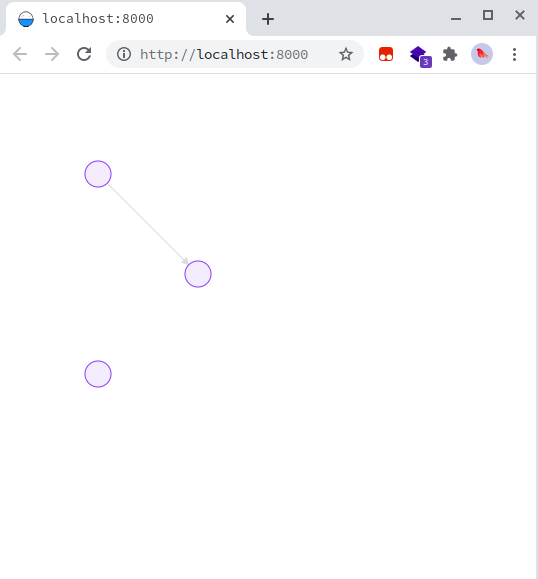
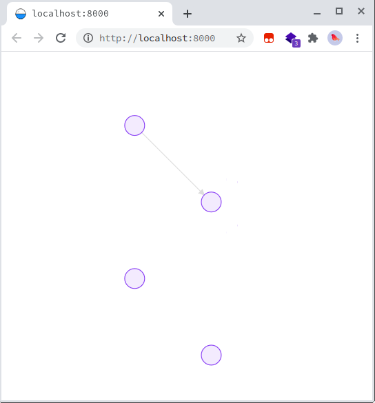
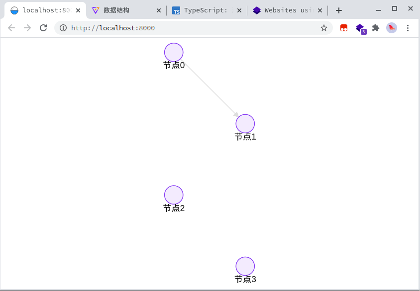
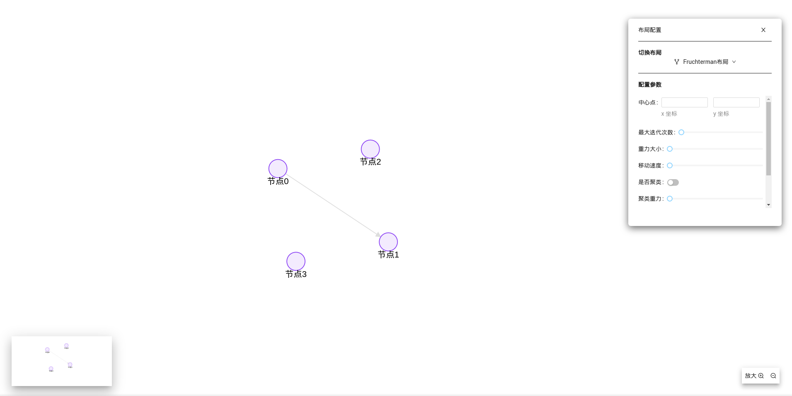
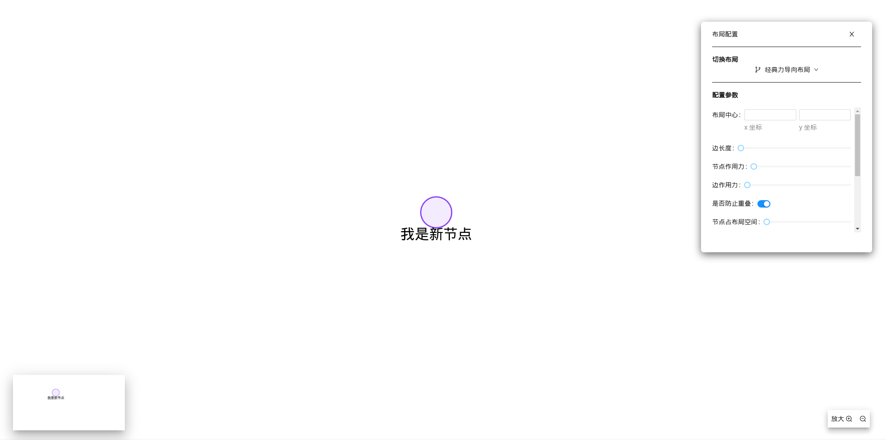

# 图可视前端应用之小试牛刀

阅读该教程不需要你预先掌握任何 React 知识。

### 课前准备

我们将会在这个教程中开发一个简单的图可视分析webapp。你将在该教程中学到关于构建 React 应用的基础知识，掌握这些知识后，你将会对前端开发有更加深刻的理解。

> 提示
>
> 这篇教程适用于更喜欢**边学边做**的开发者，如果你更喜欢从头开始学习一些概念，请参考[逐步学习指南](https://zh-hans.reactjs.org/docs/hello-world.html)。你会发现这篇教程和逐步学习指南是互补的。

这篇教程分为以下几个部分：【todo：url】

- 环境准备是学习该教程的**起点**。
- 概览介绍了 React 的**基础知识**：组件、props 和 state。
- 游戏完善介绍了在 React 开发过程中最常用的技术。
- 时间旅行可以让你更加深刻地了解 React 的独特优势。

你不必着急一口气学完这篇教程的所有内容，尽力就行，哪怕是先学习一两节。

### 我们会做出什么东西？

接下来，我们一起用 React 开发一个简单的图可视分析webapp。

你可以提前预览我们要写的webapp的**[最终效果]()**。如果你看不懂其中的代码，或不熟悉这些语法，别担心！接下来的教程会一步一步帮助你理解 React 及其语法。

### 前置知识

你应该已经在前置课程中对 HTML 和 JavaScript 比较熟悉了。即便你之前使用其他编程语言，你也可以跟上这篇教程的。除此之外，我们假定你也已经熟悉了一些编程的概念，例如，函数、对象、数组，以及 class 的一些内容。

如果你想回顾一下 JavaScript，有时间的话你可以阅读[这篇教程](https://developer.mozilla.org/zh-CN/docs/Web/JavaScript/A_re-introduction_to_JavaScript)。注意，我们也用到了一些 ES6（较新的 JavaScript 版本）的特性。在这篇教程里，我们主要使用了[箭头函数（arrow functions）](https://developer.mozilla.org/zh-CN/docs/Web/JavaScript/Reference/Functions/Arrow_functions)、[class](https://developer.mozilla.org/zh-CN/docs/Web/JavaScript/Reference/Classes)、[let](https://developer.mozilla.org/zh-CN/docs/Web/JavaScript/Reference/Statements/let) 语句和 [const](https://developer.mozilla.org/zh-CN/docs/Web/JavaScript/Reference/Statements/const) 语句。

## 环境准备

你应该在前置课程就已经搭建好了前端本地编程环境，打开你的VScode吧！！！💪🏻

### 寻求帮助

如果你遇到了任何困难，可以在组队学习群中提出问题，同学和助教都会热心回答～😘

## 概览

你已经准备好了，让我们先大致了解一下 React 吧！

### React 是什么？

> 基于jsx的组件化世界

React 是一个声明式，高效且灵活的用于构建用户界面的 JavaScript 库。使用 React 可以将一些简短、独立的代码片段组合成复杂的 UI 界面，这些代码片段被称作 “**组件**”。

React 中拥有多种不同类型的组件，我们先从 `React.Component` 的子类开始介绍：

```react
class ShoppingList extends React.Component {
  render() {
    return (
      <div className="shopping-list">
        <h1>Shopping List for {this.props.name}</h1>
        <ul>
          <li>Instagram</li>
          <li>WhatsApp</li>
          <li>Oculus</li>
        </ul>
      </div>
    );
  }
}

// 用法示例: <ShoppingList name="Mark" />
```

我们马上会讨论这些又奇怪、又像 XML 的标签。我们通过使用组件来告诉 React 我们希望在屏幕上看到什么。当数据发生改变时，React 会高效地更新并重新渲染我们的组件。

其中，`ShoppingList` 是一个 **React 组件类**，或者说是一个 **React 组件类型**。一个组件接收一些参数，我们把这些参数叫做 `props`（“props” 是 “properties” 简写），然后通过 `render` 方法返回需要展示在屏幕上的视图的层次结构。

`render` 方法的返回值*描述*了你希望在屏幕上看到的内容。React 根据描述，然后把结果展示出来。更具体地来说，`render` 返回了一个 **React 元素**，这是一种对渲染内容的轻量级描述。大多数的 React 开发者使用了一种名为 “JSX” 的特殊语法，JSX 可以让你更轻松地书写这些结构。语法 `<div />` 会被编译成 `React.createElement('div')`。上述的代码等同于：

```react
return React.createElement('div', {className: 'shopping-list'},
  React.createElement('h1', /* ... h1 children ... */),
  React.createElement('ul', /* ... ul children ... */)
);
```

[在线查看编译过程](https://babeljs.io/repl/#?presets=react&code_lz=DwEwlgbgBAxgNgQwM5IHIILYFMC8AiJACwHsAHUsAOwHMBaOMJAFzwD4AoKKYQgRlYDKJclWpQAMoyZQAZsQBOUAN6l5ZJADpKmLAF9gAej4cuwAK5wTXbg1YBJSswTV5mQ7c7XgtgOqEETEgAguTuYFamtgDyMBZmSGFWhhYchuAQrADc7EA)

如果你对这个比较感兴趣，可以查阅 [API 文档](https://zh-hans.reactjs.org/docs/react-api.html#createelement)了解有关 `createElement()` 更详细的用法。但在接下来的教程中，我们并不会直接使用这个方法，而是继续使用 JSX。

在 JSX 中你可以任意使用 JavaScript 表达式，只需要用一个大括号把表达式括起来。每一个 React 元素事实上都是一个 JavaScript 对象，你可以在你的程序中把它当保存在变量中或者作为参数传递。

前文中的 `ShoppingList` 组件只会渲染一些内置的 DOM 组件，如`<div />`、`<li />`等。但是你也可以组合和渲染自定义的 React 组件。例如，你可以通过 `<ShoppingList />` 来表示整个购物清单组件。每个组件都是封装好的，并且可以单独运行，这样你就可以通过组合简单的组件来构建复杂的 UI 界面。

### 阅读初始代码

在你的工程文件夹下打开 `src/pages`文件夹📁（你已经在前面的[环境准备]()中创建过这个文件了）。

- [ ] 修改`index.less`文件

  > less是css的超集，可以看作加强版的css
  
  我们这次给你提供现成的CSS样式，关于如何利用样式做出漂亮的页面我们会在教学计划的第二章第二期详述。

```less
.main {
  padding: 0;
  margin: 0;
  position: absolute;
  left: 0;
  top: 0;
  bottom: 0;
  right: 0;
}

.map {
  position: absolute;
  left: 32px;
  bottom: 27px;
}

.toolbar {
  position: absolute;
  width: 111px;
  height: 44px;
  right: 35px;
  bottom: 27px;
}

```

- [ ] 修改index.tsx文件

  先复制上去，下面我们会逐行解释这些代码。

```react
import Graphin from '@antv/graphin';
import styles from './index.less';

const data = {
  nodes: [
    {
      id: 'node-0',
      x: 100,
      y: 100,
    },
    {
      id: 'node-1',
      x: 200,
      y: 200,
    },
    {
      id: 'node-2',
      x: 100,
      y: 300,
    },
  ],
  edges: [
    {
      source: 'node-0',
      target: 'node-1',
    },
  ],
};

export default () => {
  return (
    <div className={styles.main}>
      <Graphin data={data} layout={{ type: 'preset' }}>
      </Graphin>
    </div>
  );
};
```

- [ ] 启动开发服务器

```bash
❯ yarn start
yarn run v1.22.10
$ umi dev
Starting the development server...

✔ Webpack
  Compiled successfully in 9.47s

 DONE  Compiled successfully in 9481ms                                                                     上午9:33:18


  App running at:
  - Local:   http://localhost:8000 (copied to clipboard)
  - Network: http://192.168.1.103:8000
```



打开浏览器，访问提示的URL，我们图可视化应用雏形就在眼前啦～ 你可以尝试拖拽节点、移动画布、使用鼠标滚轮放大缩小

**代码解释：**

```react
// 导入graphin库
import Graphin from '@antv/graphin';
// 导入样式
import styles from './index.less';

// 这里就是我们的数据
// 其中有三个node，一个link，与画布上的节点和边对应
const data = {
  nodes: [
    {
      id: 'node-0',
      x: 100,
      y: 100,
    },
    {
      id: 'node-1',
      x: 200,
      y: 200,
    },
    {
      id: 'node-2',
      x: 100,
      y: 300,
    },
  ],
  edges: [
    {
      source: 'node-0',
      target: 'node-1',
    },
  ],
};

// 这里是导出的页面组件
export default () => {
  return (
    // react 中是使用className字段来和style绑定的，我们的Graphin组件放在这个div盒子里，绑定的style让这个div盒子充满屏幕
    <div className={styles.main}>
      {/*  在组件上可以自定义组件暴露的prop属性 这里我们把需要可视化的数据传入，并且定义了layout布局，自适应画布大小 */}
      <Graphin data={data} layout={{ type: 'preset' }}  fitView={true} >
      </Graphin>
    </div>
  );
};
```

Graphin组件其他prop设置可以在这里看到：https://graphin.antv.vision/graphin/quick-start/interface

### 通过 Props 传递数据

在React除了推崇 **组件化** 思维，数据也推崇 **自上而下** 的流动

让我们试试水，尝试修改上一步的data数据，看看 Graphin 组件会产生什么变化。

我们从现在开始强烈建议你动手编写以下的代码，不要使用复制/粘贴。这将加深你对 React 的记忆和理解。

我们将代码改写成下面这样，再添加一个 node 到 data 数据中：

```react
...
const data = {
  nodes: [
    {
      id: 'node-0',
      x: 100,
      y: 100,
    },
    {
      id: 'node-1',
      x: 200,
      y: 200,
    },
    {
      id: 'node-2',
      x: 100,
      y: 300,
    },
    // begin---
    {
      id: 'node-3',
      x: 200,
      y: 400,
    }
    // end---
  ],
  edges: [
    {
      source: 'node-0',
      target: 'node-1',
    },
  ],
};
...
```

可以看到，页面立马多出了一个node，你可以随时更改数据，UI层都会同步更新显示



我们可以参考这个文档📄，修改节点的所有属性：https://graphin.antv.vision/graphin/render/data

下面我们就根据这个文档修改我们的data，来展示一下这几个节点的名字吧～

```react
...
const data = {
  nodes: [
    {
      id: 'node-0',
      style: {
        label: { value: '节点0' },
      },
      x: 100,
      y: 100,
    },
    {
      id: 'node-1',
      style: {
        label: { value: '节点1' },
      },
      x: 200,
      y: 200,
    },
    {
      id: 'node-2',/home/sovlookup/桌面/front-opensource-learning/contents/Part-1/前端入门
      style: {
        label: { value: '节点2' },
      },
      x: 100,
      y: 300,
    },
    {
      id: 'node-3',
      style: {
        label: { value: '节点3' },
      },
      x: 200,
      y: 400,
    },
  ],
  edges: [
    {
      source: 'node-0',
      target: 'node-1',
    },
  ],
};
...
```



恭喜你！你刚刚成功地掌握了如何控制组件中的数据的任务，完成了一个图可视化demo。在 React 应用中，数据通过 props 的传递，从父组件流向子组件。

### 丰富应用界面与交互

觉得这样的效果太单调了？我们来丰富一下应用的界面吧～

Graphin提供了很多现成的页面工具这次我们会为你准备 放大镜🔍、小地图、工具栏、布局选择器这四个工具，最终结果是这个样子：



准备好了吗？我们开始吧～

#### 小地图组件

- [ ] **首先更新引入**
这里我们把之后需要用的包一起导入了，自己使用的时候按需导入即可

```react
import Graphin, { GraphinContextType } from '@antv/graphin';
import {
  MiniMap,
  Toolbar,
  ContextMenu,
  FishEye,
  LayoutSelector 
} from '@antv/graphin-components';
import { ZoomOutOutlined, ZoomInOutlined } from '@ant-design/icons';
import { ToolBarItemType } from '@antv/graphin-components/lib/Toolbar';
import styles from './index.less';
import React, { useState } from 'react';
import DemoLayoutSelector from './LayoutSelector/LayoutSelectorDemo';
const { Menu } = ContextMenu;
```

- [ ] **在Graphin标签中添加MiniMap小地图组件**

```react
...
<Graphin data={data} fitView={true} layout={{ type: 'preset' }}>
    {/* 小地图 */}
    <div className={styles.map}>
      <MiniMap visible={true} />
    </div>
<Graphin />
...
```

完成～ 前端有着一种 **组件嵌套 层层叠叠** 的感觉

#### 工具栏组件

- [ ] **定义事件**

```react
export default () => {
  // 参考toolbar文档配置的options，自定义toolbar上有哪些按钮
  const options = [
    {
      key: 'zoomOut',
      name: (
        <span>
          放大 <ZoomInOutlined />
        </span>
      ),
      icon: <ZoomInOutlined />,
    },
    {
      key: 'zoomIn',
      name: <ZoomOutOutlined />,
    },
  ];

  // 这是一个箭头函数，参数为context(graphin的上下文对象)与option(点击事件)，当我将其绑定到toolbar标签上，每次对toolbar的点击都会调用这个函数
  const toolbarClick = (
    context: GraphinContextType,
    option: ToolBarItemType,
  ) => {
    // 在上下文对象上拿出我需要的功能
    const { apis } = context;
    const { handleZoomIn, handleZoomOut } = apis;
     
    // 根据传入的option事件判断点击的是哪个按钮，做出相应的行为
    if (option.key === 'zoomIn') {
      handleZoomIn();
    } else if (option.key === 'zoomOut') {
      handleZoomOut();
    }
  };
...

}
```

- [ ] **事件与UI绑定**

```react
...
<Graphin data={data} fitView={true} layout={{ type: 'preset' }}>
    {/* 工具栏 */}
    <div className={styles.toolbar}>
      <Toolbar options={options} onChange={toolbarClick} />
    </div>
<Graphin />
...
```

完成～ 交互就是 **在UI组件上挂上函数钩子**

#### 放大镜组件

我们需要按esc键随时启动关闭放大镜，那么这又怎么做到呢？除了开关的交互，肯定需要一个地方来储存放大镜的开启关闭的状态。

 - [ ] **React Hook**

React Hook 作为一种数据状态管理方式，使用起来十分轻便。

```react
export default () => {
    // 新建一个状态管理器，false为它的初始值，visible为这个状态变量，setVisible是用于改变这个变量的函数
    const [visible, setVisible] = useState(false);
    
    // 每次调用这个函数，就会打开/关闭放大镜，所以它就像一个开关一样
    const menuClick = () => {
        setVisible(!visible);
    };
...
}
```

咦？不对呀，我们想要改变visible这个变量直接用 `=` 赋值不就行了？

其实不然，你在调用 `setVisible` 的时候，React 会帮你 **重新渲染与数据改动有关的组件** ，这样UI才会更新。

你会用了吗？

- [ ] **添加组件**

将 ”开关“ 函数绑定到ESC键上

```react
...
<Graphin data={data} fitView={true} layout={{ type: 'preset' }}>
    {/* 放大镜 */}
    <FishEye options={{}} visible={visible} handleEscListener={menuClick} />
<Graphin />
...
```

现在，回到浏览器中，按一按你的ESC键看看呢？是不是有放大镜蹦出来啦？

#### 布局选择器组件

在这一关，我们提供给你现成的 “布局选择器” 组件，你需要在你的父组件里引入子 “布局选择器” 组件，并与你的数据完成绑定。

- [ ] **他山之石，可以攻玉**

对于非专业前端而言，我们要学会尽量复用别人的轮子，学会站在巨人的肩膀上

将 [LayoutSelector](https://github.com/SOVLOOKUP/front-opensource-learning/tree/master/contents/Part-1/%E5%89%8D%E7%AB%AF%E5%85%A5%E9%97%A8/src/LayoutSelector) 文件夹📁 (点击网址即可在github页面上查看) 复制到你工程文件夹的的 `src/pages` 目录下

由于我们前面已经引入这个组件 (`import DemoLayoutSelector from './LayoutSelector/LayoutSelectorDemo'`) 了，这里我们直接进入下面。

- [ ] **定义Hook及事件**

我们需要动态修改布局，也就需要动态更新layout，这里需要把我们的layout数据做成一个React Hook，并且定义动态更新布局的事件

```react
export default () => {
  // 将layout做成一个React Hook
  const [layout, setLayout] = useState({ ...defaultLayout, animation: true });

  // 动态更新布局的事件
  const updateLayout = (previousType: string, type: string) => {
    setLayout({ ...defaultLayout, type });
  };
...
}
```

- [ ] **UI数据事件绑定**

```react
...
// 注意这里layout数据修改了
<Graphin data={data} layout={layout} fitView={true}>
    {/* 布局选择器 */}
    <LayoutSelector>
      {/* 将布局更新的行为与事件绑定 */}
      <DemoLayoutSelector updateLayout={updateLayout} />
    </LayoutSelector>
<Graphin />
...
```
OK～到这里我们大功告成，我们的目标完美完成！你现在已经有写基本的前端APP的能力了，是不是十分简单？

最后给出总体代码，最后增加了一个右键菜单组件，你能看懂吗？

```react
import Graphin, { GraphinContextType } from '@antv/graphin';
import {
  MiniMap,
  Toolbar,
  ContextMenu,
  FishEye,
  LayoutSelector 
} from '@antv/graphin-components';
import { ZoomOutOutlined, ZoomInOutlined } from '@ant-design/icons';
import { ToolBarItemType } from '@antv/graphin-components/lib/Toolbar';
import styles from './index.less';
import { useState } from 'react';
import DemoLayoutSelector from './LayoutSelector/LayoutSelectorDemo';
const { Menu } = ContextMenu;

const defaultLayout = {
  type: 'graphin-force',
  preset: {
    type: 'concentric',
  },
  animation: true,
};

const data = {
  nodes: [
    {
      id: 'node-0',
      style: {
        label: { value: '节点0' },
      },
      x: 100,
      y: 100,
    },
    {
      id: 'node-1',
      style: {
        label: { value: '节点1' },
      },
      x: 200,
      y: 200,
    },
    {
      id: 'node-2',
      style: {
        label: { value: '节点2' },
      },
      x: 100,
      y: 300,
    },
    {
      id: 'node-3',
      style: {
        label: { value: '节点3' },
      },
      x: 200,
      y: 400,
    },
  ],
  edges: [
    {
      source: 'node-0',
      target: 'node-1',
    },
  ],
};

// 这里是导出的页面父组件
export default () => {
  const [layout, setLayout] = useState({ ...defaultLayout, animation: true });

  const updateLayout = (previousType: string, type: string) => {
    setLayout({ ...defaultLayout, type });
  };

  const [visible, setVisible] = useState(false);
  const menuClick = () => {
    setVisible(!visible);
  };

  const options = [
    {
      key: 'zoomOut',
      name: (
        <span>
          放大 <ZoomInOutlined />
        </span>
      ),
      icon: <ZoomInOutlined />,
    },
    {
      key: 'zoomIn',
      name: <ZoomOutOutlined />,
    },
  ];

  const toolbarClick = (
    context: GraphinContextType,
    option: ToolBarItemType,
  ) => {
    const { apis } = context;
    const { handleZoomIn, handleZoomOut } = apis;
    if (option.key === 'zoomIn') {
      handleZoomIn();
    } else if (option.key === 'zoomOut') {
      handleZoomOut();
    }
  };


  return (
    <div className={styles.main}>
      {/*  在组件上可以自定义组件暴露的prop属性 这里我们把需要可视化的数据传入，并且定义了layout布局，自适应画布大小 */}
      <Graphin data={data} layout={layout} fitView={true}>
        {/* 小地图 */}
        <div className={styles.map}>
          <MiniMap visible={true} />
        </div>

        {/* 工具栏 */}
        <div className={styles.toolbar}>
          <Toolbar options={options} onChange={toolbarClick} />
        </div>

        {/* 右键菜单 */}
        <ContextMenu bindType="canvas">
          <Menu bindType="canvas">
            <Menu.Item onClick={menuClick}>开启放大镜🔍</Menu.Item>
          </Menu>
        </ContextMenu>

        {/* 放大镜 */}
        <FishEye options={{}} visible={visible} handleEscListener={menuClick} />

        {/* 布局选择器 */}
        <LayoutSelector>
          <DemoLayoutSelector updateLayout={updateLayout} />
        </LayoutSelector>
      </Graphin>
    </div>
  );
};
```
### 封装成自己的组件

然而这还不够，如果别人想使用我写的这个功能怎么办？？？让我们把它封装成一个组件！

- [ ] **新建一个文件夹存放组件**

我们在 `src/pages` 中新建一个文件夹📁，取名`myComponent`，进入这个文件夹

直接将上层的 `index.less` 、 `index.jsx` 和 `LayoutSelector` 文件夹📁移动到`myComponent`文件夹下

前端中入口通常会使用 `index` 命名

- [ ] **调用我们的组件**

回到 `src/pages` 文件夹📁下，创建新的主入口文件 `index.jsx`

```react
import Myapp from './myComponent/index'
export default () => <Myapp/>
```

打开浏览器，发现效果和之前一模一样，但现在只要2行代码就可以实现，这就是组件化的魅力～

### 分离数据与UI层

再进一步，如果别人在调用我们的组件的时候需要自定义可视化数据怎么办？

因此，我们就要分离数据和UI层，让组件从prop中读取数据

- [ ] **分离数据**

对 `src/pages/myComponent/index.jsx` 修改如下

```react
...
export default ( props: {data ?:  GraphinTreeData | GraphinData  }  ) => {
  // 如果没有传入data，则展示默认data
  if (props.data === undefined) {
    props.data = defaultData
  }

  // 取出props中的data
  const { data } = props
...
}
```

- [ ] **调用组件**

现在我们就可以在上层向组件传入任意的图可视数据 `data ` 啦～

```react
import Myapp from './myComponent/index';

const mydata = {
  nodes: [
    {
      id: 'node-0',
      style: {
        label: { value: '我是新节点' },
      }
    },
  ],
  edges: [],
};

export default () => <Myapp data={mydata} />;
```

- [ ] **查看效果**

效果如下：



### 总结

恭喜你！你已经完成了一个拥有以下功能的图可视化前端啦：

- 美观的图可视化
- 9种有出色动画的图布局
- 屏幕放大镜
- 可视化屏幕地图🗺️
- 可以定制的工具栏

干的不错！我们希望你至此已经基本掌握了 React 的使用。

在这里可以查看最终的应用代码:**[最终成果](https://codepen.io/gaearon/pen/gWWZgR?editors=0010)**.

如果你还有充裕的时间，或者想练习一下刚刚学会的 React 新技能，这里有一些可以改进应用的想法供你参考：

1. 翻阅文档，你是不是能发现更多让这个WebAPP更美观的prop属性。
2. 能不能自定义鼠标点击拖动行为，框选多个node？
3. 你能根据文档完成最短链路查找🔍的功能吗？

通过这篇教程，我们接触了 React 中的一些概念，比如 React 元素、React 组件、props，还有 state。更多关于这些概念的细节的解释，参考[官方文档](https://zh-hans.reactjs.org/docs/hello-world.html)。了解更多关于组件定义的内容，参考[`React.Component` API reference](https://zh-hans.reactjs.org/docs/react-component.html)。

---

原教程地址： https://zh-hans.reactjs.org/tutorial/tutorial.html

