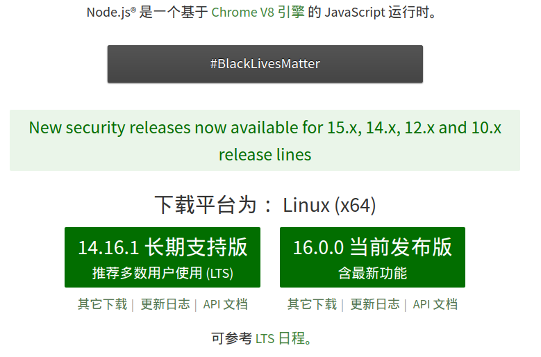
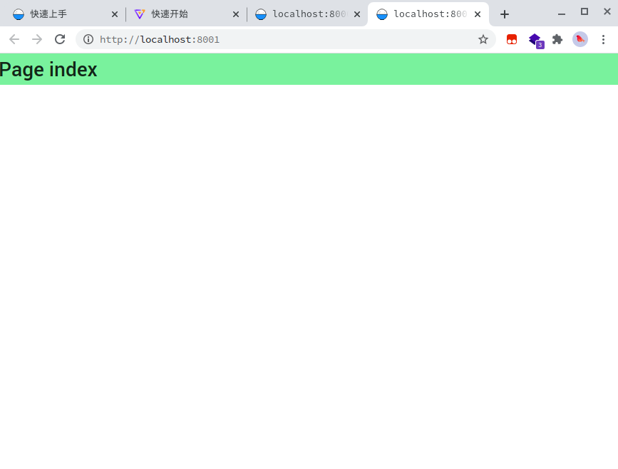

# 环境准备与项目初始化

> 文章编写人：夏凡
>
> github 地址：[sovlookup](https://github.com/sovlookup)

熟悉完整的前端开发流程

## 我在准备的是什么环境？

如果把我们制作图可视分析webapp的需求比作炼出一颗金丹，那么：

- 炼丹的柴火：前置课程中你应该已经学习了JavaScript等基础知识，这是我们的 “炼丹“ 的材料，前端大半壁江山都依靠庞大的js生态。
- 丹炉的底座：这是我们这里在准备的环境，Node.js是一个JavaScript运行时，你需要这个 “炉子” 来炼出你的 “金丹” 。
- 烧炉的火钳：nrm、yarn、npm都是一些小工具，它们是你 “炼丹” 的路上不可或缺的帮手。
- 炼丹炉：Umi是一个React开发框架，本质上我们还是在写React，用Umi脚手架比起直接用React可以帮我们解决很多操心事，所以我们就选款 ”炉子“ 吧～

> 前端的生态是如此庞大，所有工具的创新方案都层出不穷，期待和你在接下来的课程中一起探索～

## ✨”设坛起炉“——环境准备

- [ ] **安装 ”丹炉底座“ node.js**

从 https://nodejs.org/zh-cn/ 下载安装**长期支持版**即可




- [ ] **安装yarn**

  ```bash
  npm install -g cnpm --registry=https://registry.npm.taobao.org
  cnpm install -g yarn
  ```

- [ ] **安装nrm并且切换源**

  像python一样，因为中国特殊的网络原因，需要配置淘宝源。
  
  ```
  yarn global add nrm
  nrm use taobao
  ```

## 🔥”起火炼丹“——项目初始化

- [ ] **建一个空目录并进入目录**

  这就是你的项目目录

```bash
$ mkdir myapp && cd myapp
```

- [ ] **创建项目脚手架**

```bash
$ yarn create @umijs/umi-app
# 或 npx @umijs/create-umi-app

Copy:  .editorconfig
Write: .gitignore
Copy:  .prettierignore
Copy:  .prettierrc
Write: .umirc.ts
Copy:  mock/.gitkeep
Write: package.json
Copy:  README.md
Copy:  src/pages/index.less
Copy:  src/pages/index.tsx
Copy:  tsconfig.json
Copy:  typings.d.ts
```

- [ ] **项目初始化依赖**

  安装依赖包

```bash
$ yarn

yarn install v1.21.1
[1/4] 🔍  Resolving packages...
success Already up-to-date.
✨  Done in 0.71s.
```

- [ ] **添加Graphin依赖**

```bash
yarn add @antv/graphin@latest --save
yarn add @antv/graphin-components@latest --save
yarn add @antv/graphin-icons --save
```

- [ ] **启动项目**

  自带热重启等实用开发功能，修改代码后浏览器中就会动态变化

```bash
$ yarn start

Starting the development server...

✔ Webpack
  Compiled successfully in 17.84s

 DONE  Compiled successfully in 17842ms                                       8:06:31 PM


  App running at:
  - Local:   http://localhost:8000 (copied to clipboard)
  - Network: http://192.168.12.34:8000
```



- [ ] **查看你的项目目录结构**

   我们本课程内容只需要修改`src`目录下的`pages`中的文件，其他内容以后有机会介绍，我们的项目目录结构大致是这样的：
  
  ```
  .
  ├── package.json
  ├── .umirc.ts
  ├── .env
  ├── dist
  ├── mock
  └── src
      ├── .umi
      ├── pages
          ├── index.less
          └── index.tsx
  ```
  
  - 根目录
  
    - **package.json**
  
      项目依赖、项目名称等基本信息
  
    - **.umirc.ts**
  
      由umi提供的项目统一配置文件
  
  - dist 目录
  
    执行 `umi build` 后，编译后待发布的产品默认会存放在这里。
  
  - `/src` 目录
  
    - pages 目录
  
      所有路由组件存放在这里。

## 🎉”炼化金丹“——**部署发布**
打包成可以离线运行的发行文件

```bash
$ yarn build

✔ Webpack
  Compiled successfully in 17.17s

 DONE  Compiled successfully in 17167ms                                       8:26:25 PM

Build success.
✨  Done in 20.79s.
```

文件发布在`dist`目录下，这里就可以提供给静态服务器使用啦～


OK 到这里你已经把 “药” 成功炼制成了 ”丹“ 庆祝一下吧！🙌🏻

下面我们就要精炼 ”丹衣“ 下的 ”丹药“ ——具体的代码啦～

---
1. UmiJS文档📄: https://umijs.org/zh-CN/docs/
2. Graphin文档📄: https://graphin.antv.vision/graphin/quick-start/introduction
3. 目录结构介绍地址: https://umijs.org/zh-CN/docs/directory-structure