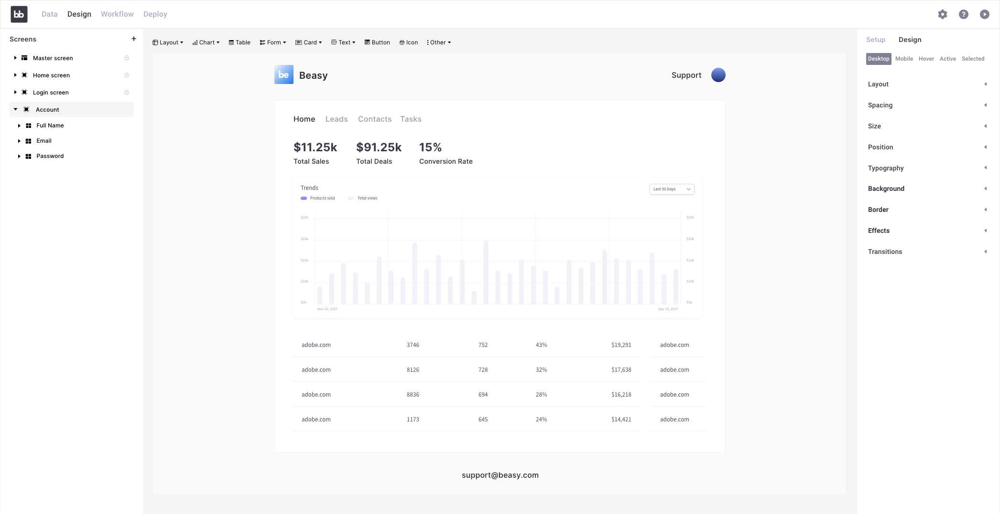
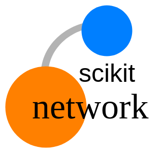
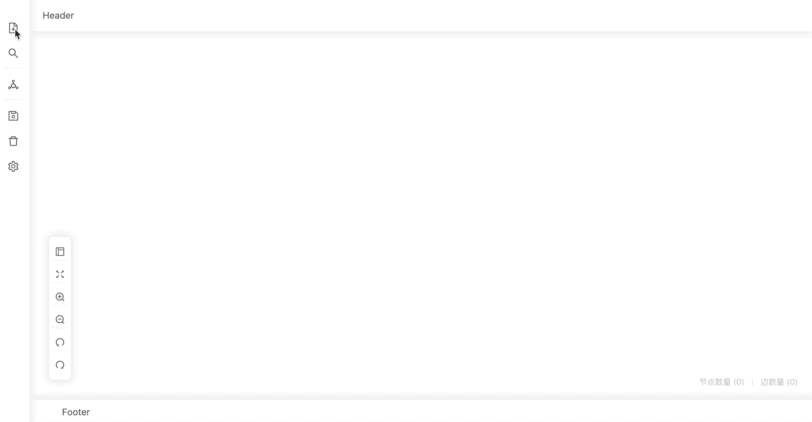

# 数据分析者的前端开源学习路线(设计中)

本来是自己学习的路线，但是和别人沟通以后发现，原来这个痛点很普遍，于是写下这个路线，希望感兴趣的小伙伴来一起参与开源学习.

## 问题背景

### 需求

- 项目中，有关数据和结果展示的部分，有**可视化和交互的需求**

- 有的时候需要简单的表单按钮交互，有的时候需要网页中呈现可视化后的数据结果，甚至直接在可视化图表上与数据进行交互分析

- plotly和pyecharts生成的图表交互和**表现力很有限**，**效果并不是很好**，交互只能用input/output，或flask/django做一些**简陋的页面**，但不能满足需求

- 虽然demo能够运行但不能给使用者良好的体验，但我想像那些大佬一样做出**真正让人惊艳的产品**

### 现状

- 人都是颜值党(颜值即正义)，自己**辛辛苦苦读论文写代码算法做出来的项目，还没有界面做的漂亮的项目有优势**

- 比赛的时候评委看到最后视觉疲劳，不看我的代码思路和公式，有**好的交互展示创意的项目反而让评委眼前一亮**，拿到高分

- 每个系统都有自己自带的可视化，有的还很漂亮，但是**无法接入自己的项目**，看着心痒痒

- 网上找了很多产品有的缺功能有的不好看有的不开源，总**不能满足自己所有的需求**，找前端公司定制又太贵

## 案例

**DataWhale 成员　段同学**

> 在21期知识图谱打卡学习之后，我想把neo4j里知识图谱可视化的效果集成到自己的项目中，但是发现自己既缺少相应的前端知识，也没有合适的Python组件和工具．

**某比赛参赛项目队长　夏同学**

> 项目关于知识图谱偏应用方向，需求是建立知识图谱并且利用知识图谱进行展示分析．但是在技术选型的时候发现没有完全符合需求的可视化套件．不想已经做好的项目成果没有美观的展示而吃亏．

## 谁适合参加

**基础**

- 需要python基础

- 了解过JavaScript和HTML技术

**需求**

- 想入门学习前端，但不是专业的开发人员
- 开源项目爱好者，但是一个人的力量太小
- 有项目和比赛需求，但不知到如何解决
- 做了很多技术工作，但是因为沟通和展示问题不被认可

## 参加能获得什么

- 快速前端开发能力
- 图数据分析能力
- 出众的数据展示与可视化能力
- 团队协作与沟通能力
- 开源成就感和开源产品思维
- 比赛技巧与项目经验

## 学习路线规划

因为本路线是写给数据分析者的，所以从数据分析的业务开始，以现在火起来的图数据分析为学习切入点，渐进式学习

Graph is the future.

### 1. 前端与图数据分析基础

#### 1.1 图数据处理入门

1. 知识图谱了解(接21期知识图谱学习)

2. 图数据库了解(**[ArangodDB](https://www.arangodb.com/)**)

3. 图数据分析了解(图数据理论)

####  1.2 前端基础知识

1. **[svelte](https://svelte.dev/)**框架
2. **[d3.js](https://d3js.org/)**基础可视化练习(柱状图,饼图,河流图)
3. 基于**[d3.js](https://d3js.org/)**的图可视化开源组件**[GraphVis](https://gitee.com/baopengdu/GraphVis)**

#### 1.3 可视化你的知识图谱(图数据分析结合与前端展示结合)

![simplescreenrecorder-2021-01-30_23.03.19 00_00_02-00_00_10 [480p]](project.assets/simplescreenrecorder-2021-01-30_23.03.19%2000_00_02-00_00_10%20%5B480p%5D.gif)

### 2. 前端低代码开发(原理已get 搭上最酷的快车)

基于**完全开源**的低代码开发平台：https://www.budibase.com/　开发应用

像excel一样编辑数据

可见即可得地编辑页面

用流程图表示程序

部署上线

#### 大作业(为1k+star的开源项目贡献图可视化组件)

 https://github.com/Budibase/budibase

**目的**：

- 熟悉如何快速地给自己的项目作品加上一个美观的前端界面，以最少的工作量满足数据可视化，表单交互，数据库管理等等需求
- 基于开源项目开发，把实现的功能提交到原项目中，最大化减少重复劳动，真正达到人人为我我为人人的开源精神

**收获**：

- 培养代码规范，产品能力，了解一流开源产品的现状

- 亲身参与开源项目建设，亲历开源贡献过程，感受国际开源社区氛围，找到开源成就感，培养开源思维

### 3. 图数据分析实战(数据分析与前端可视化分析结合的完整项目)

#### 3.1 图数据分析原理(python库)

https://github.com/sknetwork-team/scikit-network

#### 3.2 图数据分析可视化实战

https://github.com/antvis/Graphin

### 4. 图数据时空分析实战

![65d5dbe8-d78d-4c6b-9318-fa06b1456784 00_00_00-00_00_08 [480p]](project.assets/65d5dbe8-d78d-4c6b-9318-fa06b1456784%2000_00_00-00_00_08%20%5B480p%5D.gif)

https://github.com/antvis/L7 or https://github.com/keplergl/kepler.gl

### 5. Ｍore...

打算做些更酷的东西？一次来参与学习路线规划吧～

## 创新点和价值

    <h3>
    开源共建　｜　解决痛点　｜　增长经验　｜　丰富生态
    </h3>

## 已经有的资源

BudiBase官方的支持(Discord)

## 评价体系

量化考核

### 个人

领导协作能力

问题沟通能力

技术思维能力

项目展示能力

### 团队

影响力

活跃度

产品效果

团队建设(知识沉淀/管理分工)

## 路线设计考察分析记录

以科学的方法规划路线[^[1]^](https://www.deefinkandassociates.com/Chinese_SelfDirectedGuide.pdf)

#### 基本信息

- 贡献人员：
- 学习周期：
- 学习形式：理论+实践
- 先修内容：[Python编程语言](https://github.com/datawhalechina/team-learning-program/tree/master/Python-Language) [前端基础](https://github.com/datawhalechina/team-learning-program/blob/master/WebSpider/task1%20HTTP%E3%80%81%E7%BD%91%E9%A1%B5%E5%9F%BA%E7%A1%80%E3%80%81requests%E3%80%81API%E3%80%81JS.md) 
- 推荐内容：[自然语言处理(知识图谱)](https://github.com/datawhalechina/team-learning-nlp/tree/master/KnowledgeGraph_Basic) [数据挖掘基础算法](https://github.com/datawhalechina/team-learning-data-mining) 
- 难度系数：中

#### 项目计划

- Step1　　招募学习路线开源共建者
- Step2　　共建者讨论实践改进学习方案,沉淀学习资料
- Step3　　招募学习成员组队学习
- Step4　　总结评价学习成果
- Step5　　选拔积极者参与开源项目与学习路线构建

#### 学习安排

|  期数  |         主题         |                          内容                          |
| :----: | :------------------: | :----------------------------------------------------: |
| 第一期 | 前端与图数据分析基础 |            学习基础知识，自己做一个简单demo            |
| 第二期 |    前端低代码开发    |      接触并体验前端前沿技术，亲自动手完成开源贡献      |
| 第三期 |    图数据分析实战    |                     深度了解图算法                     |
| 第四期 |   图可视化分析实战   | 深度了解图可视化，并与图数据分析结合，完成一个高级demo |
| 第五期 |  图数据时空分析实战  |         图与时空数据,分析与可视化结合，太酷了          |
| 第六期 | 图数据可视化综合实战 |             maybe一起打个比赛或是做个项目              |

#### 技术选型

**主要技术学习方向选择**

| 名称       | 代表               | 创新性 | 美观性 |
| ---------- | ------------------ | ------ | ------ |
| 表数据分析 | 柱状图,饼图,折线图 | 否     | 中     |
| 图数据分析 | 关系图,河流图,地图 | 是     | 高     |

- 随着nosql和newsql的越来越流行，图数据的规模越来越大，需求也日益增长，但是很多数据分析人员依然不熟悉甚至不知道图数据如何进行分析
- 比赛和项目重要的一个得分点是创新，图数据分析比表数据分析的应用更创新
- Graph is the future.
- 以图数据分析为切入点能用新鲜感驱动学习者，给数据分析学习者熟悉又陌生的感觉

**数据分析切入点工具选型**

| 名称                                                         | 语言   | 领域   | 性能 | 易用性 |
| ------------------------------------------------------------ | ------ | ------ | ---- | ------ |
| **[NetworkX](https://github.com/networkx/networkx)**         | python | 图分析 | 中   | 中     |
| **[scikit-network](https://github.com/sknetwork-team/scikit-network)** | python | 图分析 | 较高 | 高     |
| **[jena](https://jena.apache.org/)**                         | java   | 图分析 | 高   | 中     |

- **[scikit-network](https://github.com/sknetwork-team/scikit-network)**用python比较容易入手，并且易用性更高[^[2]^](https://zhuanlan.zhihu.com/p/345992526)

**可视化分析工具选型**

|                         名称                         |        语言        | 组件 | 灵活性 | 易用性 |
| :--------------------------------------------------: | :----------------: | :--: | :----: | :----: |
|      **[Echarts](https://echarts.apache.org/)**      | python,javascript  | 丰富 |   中   |   高   |
|            **[D3.js](https://d3js.org/)**            |     javascript     | 丰富 |   高   |   中   |
|         **[G6](https://g6.antv.vision/zh)**          |     javascript     | 一般 |   高   |   中   |
|     **[Graphin](https://graphin.antv.vision/)**      |      js-react      | 丰富 |   差   |   高   |
| **[GraphVis](https://gitee.com/baopengdu/GraphVis)** | javascript(基于D3) | 一般 |   高   |  中高  |

- 去除比较底层，学习成本较大的库(**[D3.js](https://d3js.org/)**,**[G6](https://g6.antv.vision/zh)**)
- 去除绑定特定框架，不能在自己项目中灵活应用的库(**[Graphin](https://graphin.antv.vision/)**)
- **[Echarts](https://echarts.apache.org/)**和基于**[D3.js](https://d3js.org/)**的**[GraphVis](https://gitee.com/baopengdu/GraphVis)**都值得学习，**[GraphVis](https://gitee.com/baopengdu/GraphVis)**更专精在图谱可视化分析，根据学习图分析的目的取**[GraphVis](https://gitee.com/baopengdu/GraphVis)**进行学习，后期深入学习图可视化可能会用到图分析更专精的**[Graphin](https://graphin.antv.vision/)**，第六期前端可视化综合实战部分可能会用组件功能更丰富的**[Echarts](https://echarts.apache.org/)**

**图数据库选型**

| 名称                                                     | 特征                                                         |
| -------------------------------------------------------- | ------------------------------------------------------------ |
| **[Neo4j](https://neo4j.com/)**                          | 社区版开源，使用广泛，有python封装                           |
| **[ArangodDB](https://www.arangodb.com/)**               | 开源，python,go封装完备，内置Foxx可拓展，事务，性能，提供文档/键值对储存模型，可以储存时间序列和GIS信息，机器学习组件支持 |
| **[JanusGraph](https://janusgraph.org/)**                | 开源，python封装完备，事务，可扩展，支持原生图谱分析推理     |
| **[NebulaGraph](https://www.zhihu.com/org/nebulagraph)** | 开源，分布式免费                                             |
| **[TigerGraph](https://www.tigergraph.com/)**            | 闭源                                                         |

- 闭源直接Pass，另外综合考虑社区因素(neo4j和arangodb社区比较好)，技术因素(arangodb功能比neo4j丰富许多)，故选用arangodb
- arangodb节点能以json储存且是多模型数据库，原生支持分析时需要用到的地理/时间等格式的信息储存

**前端框架选型**

| 名称                                       | 学习成本 |
| ------------------------------------------ | -------- |
| **[Svelte](https://svelte.dev/)**          | 中       |
| **[React](https://zh-hans.reactjs.org/)**  | 高       |
| **[Vue](https://cn.vuejs.org/index.html)** | 高       |

- 可以详看这个比较：https://dev.to/hb/react-vs-vue-vs-angular-vs-svelte-1fdm
- 框架并没有绝对的优劣，个人观点就体验而言，**[Svelte](https://svelte.dev/)**开发效率和便捷性还是非常适合数据分析人员使用的．React和Vue技术栈较深，更适合专业前端
- 另外选用**[Svelte](https://svelte.dev/)**可以将自己的项目组件与[Budibase](https://github.com/Budibase/budibase)结合，进行低代码开发和复用

## 贡献者信息

|  姓名  | 介绍 |            个人主页             |
| :----: | :--: | :-----------------------------: |
|  夏凡  |  －  |  https://github.com/sovlookup   |
| 段秋阳 |  －  | https://github.com/DallasAutumn |

---

[^1]: "课程设计自学指南：如何设计课程以促进意义深远的学习"
[^2]: "scikit-network介绍"
